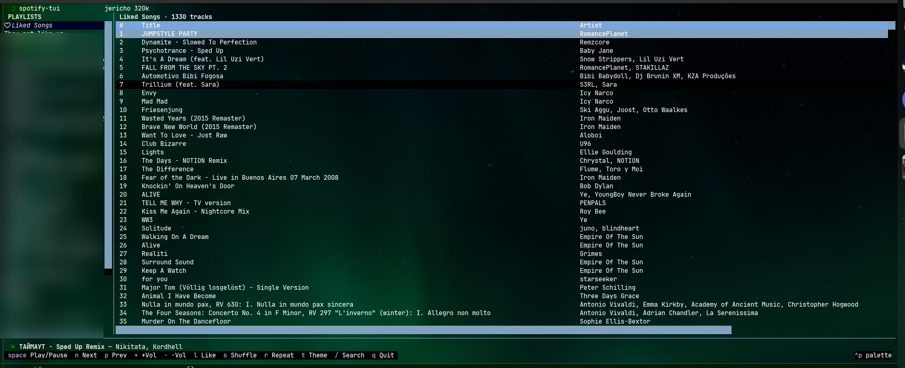

# spotify-tui

A terminal UI for controlling Spotify.



## Install

```
pipx install .
# or
pip install .
```

## Setup

```
spotify-tui setup
```

Walks you through creating a Spotify app and authorizing access.

## Usage

```
spotify-tui
```

## Keybindings

| Key       | Action      |
|-----------|-------------|
| Space     | Play/Pause  |
| n         | Next track  |
| p         | Prev track  |
| + / -     | Volume      |
| l         | Like/unlike |
| s         | Shuffle     |
| r         | Repeat      |
| /         | Search      |
| t         | Cycle theme |
| Tab       | Switch focus|
| Esc       | Back        |
| q         | Quit        |

## Prerequisites

- Spotify Premium account
- Python 3.11+
- Linux or macOS
- A Spotify Connect device running somewhere (desktop app, phone, web player, spotifyd, etc.)

## License

MIT

Built by Mauricio and Claude ❤️
